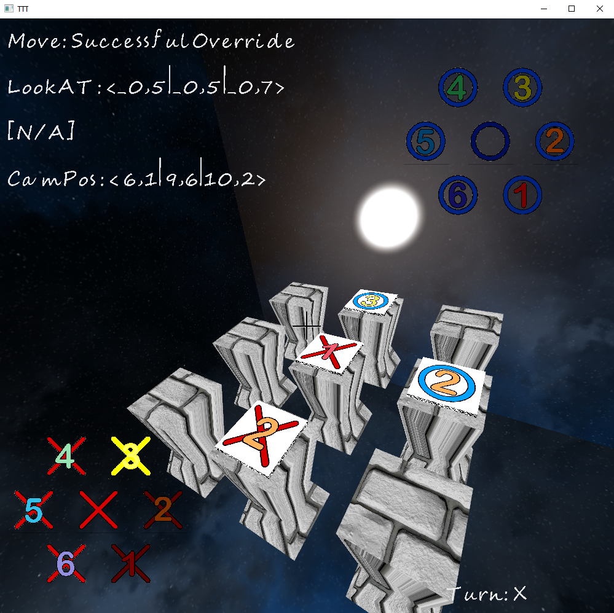

# CGAProject (SS21)
# Projektname
Provisorisch: TTT

# Teammitglieder
| Name | Martikelnummer | Studiengang |
|------|----------------|-------------|
| Lukas Momberg | 11141259 | AI | 
| Jona Siebel | 11141394 | AI |
| Nico Brenner | 11096415 | MI |

# Featureliste
| Feature | implementiert von.. |
|---------|---------------------|
| EventSystem | Lukas Momberg |
| SpriteFont(.FNT) Support | Lukas Momberg |
| Game Rules | Jona Siebel |
| Raycast (Object Select) | Jona Siebel |
| Modellierung | Nico Brenner |

# Bilder

